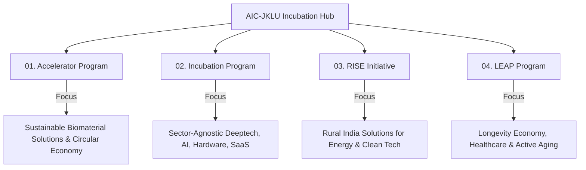

# 🏛️ AIC-JKLU — Atal Incubation Centre Website

<div align="center">


<br />

**Backing Visionary Founders Building the Future from Jaipur.**  
*Supported by Atal Innovation Mission (AIM), NITI Aayog (Govt. of India) & JK Lakshmipat University.*

<br />

[Explore Programs](#-flagship-incubation--acceleration-programs) • [Startup Directory](#-portfolio--startup-directory-95-ventures) • [Partner Ecosystem](#-interactive-orbital-partner-ecosystem) • [Architecture](#-project-architecture--directory-structure) • [Getting Started](#-getting-started--local-development)

</div>

---

## 📌 Table of Contents

- [🏛️ About AIC-JKLU](#️-about-aic-jklu)
- [✨ Key Platform Features](#-key-platform-features)
- [🎨 Design System & Editorial Aesthetics](#-design-system--editorial-aesthetics)
- [🚀 Flagship Incubation & Acceleration Programs](#-flagship-incubation--acceleration-programs)
- [💼 Portfolio & Startup Directory (95+ Ventures)](#-portfolio--startup-directory-95-ventures)
- [🌐 Interactive Orbital Partner Ecosystem](#-interactive-orbital-partner-ecosystem)
- [👥 Stakeholders, Mentors & Leadership](#-stakeholders-mentors--leadership)
- [📚 Multimedia Archive & Knowledge Library](#-multimedia-archive--knowledge-library)
- [🏗️ Project Architecture & Directory Structure](#️-project-architecture--directory-structure)
- [💻 Tech Stack & Core Libraries](#-tech-stack--core-libraries)
- [⚙️ Data Layer & Schema Overview](#️-data-layer--schema-overview)
- [🛠️ Getting Started & Local Development](#️-getting-started--local-development)
- [🧪 Testing & Quality Assurance](#-testing--quality-assurance)
- [🚀 Production Build & Deployment](#-production-build--deployment)
- [🧭 Geographic Coordinates & Institution Info](#-geographic-coordinates--institution-info)

---

## 🏛️ About AIC-JKLU

**Atal Incubation Centre - JK Lakshmipat University (AIC-JKLU)** is a premier startup incubation centre established under the aegis of the **Atal Innovation Mission (AIM)**, **NITI Aayog**, Government of India, and supported by **JK Lakshmipat University (JK Organisation)**.

Based in Jaipur, Rajasthan, AIC-JKLU provides early-stage innovators and high-growth deeptech, biomaterial, energy, healthcare, and software ventures with:
- **Seed & Scale Funding Support** (NITI Aayog Grants, Startup India Seed Fund, Angel Networks, VCs).
- **Advanced Prototyping Labs & Co-Working Infrastructure**.
- **1-on-1 Mentorship** from industry veterans, academic researchers, and venture capitalists.
- **Corporate & Government Connects** across national and global partner networks.

This web application serves as the flagship digital portal for cohort applications, portfolio discovery, ecosystem visualization, and knowledge dissemination.

---

## ✨ Key Platform Features

| Feature | Description |
| :--- | :--- |
| **Luxury Editorial Layout** | High-trust, publication-grade aesthetics featuring refined serif headlines, technical monospace metadata, and warm canvas surfaces. |
| **Interactive Orbital Partner Map** | Mathematical, SVG-based radial visualization displaying concentric orbits and 50+ corporate, VC, and government partners. |
| **95+ Startup Directory** | Real-time searchable and filterable database of 95+ incubated companies across sectors, cohorts, and business models with modal deep-dives. |
| **Dynamic Multi-Program Pathways** | Dedicated pages for Flagship Accelerator, Incubation, RISE (Rural Energy), and LEAP (Longevity Economy). |
| **Stakeholder Directory** | Categorized network of Founders, Mentors, Investors, and Leadership with detailed domain and profile information. |
| **Multimedia Knowledge Hub** | Media grid showcasing podcast episodes, news clippings, photo archives, and industry publications. |
| **Interactive Application Portal** | Seamless pre-filled multi-step application workflow for prospective startup founders. |
| **Cinematic Preloader & Parallax** | Custom session-aware geometric box-reveal preloader and layered scroll parallax effects. |

---

## 🎨 Design System & Editorial Aesthetics

The platform follows a bespoke **Architectural / Editorial Design Language** engineered to convey high institutional prestige and venture-grade credibility.

### 1. Typography Hierarchy

| Font Family | Token / Variable | Target Elements | Aesthetic Role |
| :--- | :--- | :--- | :--- |
| **Marcellus** | `var(--font-marcellus)` | Hero headlines, section titles, startup names | High-luxury serif, humanistic warmth |
| **Roboto Mono** | `var(--font-roboto-mono)` | Metadata, tags, coordinates, buttons, nav links | Precision engineering, blueprint clarity |
| **Inter / Sans** | Default system sans | Long-form body paragraphs, descriptions | High-legibility editorial content |

### 2. Tailored Color Palette

```
  CANVAS          SURFACE         OBSIDIAN        JAIPUR ORANGE     HAIRLINE
  #FBF7F0         #FFFFFF         #121212         #EB5725           #E4E4E0
┌───────────────┬───────────────┬───────────────┬─────────────────┬───────────────┐
│               │               │               │                 │               │
│  Background   │  Card Surface │  Primary Text │  Brand Accent   │  Border Grids │
│               │               │               │                 │               │
└───────────────┴───────────────┴───────────────┴─────────────────┴───────────────┘
```

- **Canvas (`#FBF7F0` / `#FBFBFA`)**: Warm paper-like background that eliminates eye fatigue.
- **Surface (`#FFFFFF`)**: Pure white layered card elevations.
- **Obsidian (`#121212` / `#151515`)**: Deep ink-black typography for sharp contrast.
- **Jaipur Brand Accent (`#EB5725`)**: Signature terracotta-orange homage to the Pink City of Jaipur.
- **Brand Hover (`#C84214`)**: Darkened amber-orange for micro-interactions.
- **Brand Tint (`#FFF2ED` / `#FFF8F4`)**: Soft peach glow for active states, pills, and highlights.
- **Hairline (`#E4E4E0` / `#D9D3CA`)**: Ultra-thin construction guidelines and borders.

---

## 🚀 Flagship Incubation & Acceleration Programs

The portal highlights 4 core specialized incubation and acceleration tracks:



1. **Accelerator Program (`/programs`)**: High-intensity cohort for sustainable biomaterial, circular economy, and deep-tech sustainability ventures.
2. **Incubation Program (`/programs/incubation`)**: Sector-agnostic comprehensive 18-month incubation providing labs, grants, and co-working facilities.
3. **RISE (`/programs/rise`)**: *Rural India Solution for Energy* — Grassroots decentralized clean power and rural industrial transformation.
4. **LEAP (`/programs/leap`)**: *Longevity Economy Accelerator Program* — Empowering innovation in healthcare, preventive wellness, and eldercare ecosystems.

---

## 💼 Portfolio & Startup Directory (95+ Ventures)

The directory routes (`/companies`, `/company/[slug]`, `/companies/[slug]`) are powered by a structured dataset of 95+ startups incubated at AIC-JKLU:

- **Instant Live Search**: Search across company names, founder bios, and solution tags.
- **Sector Filtering**: AI & Deeptech, Agritech, Healthtech, Clean Energy, Edtech, Consumer Tech, and Biomaterials.
- **Interactive Modals & Dedicated Pages**: Complete founder biographies, funding stage, batch cohort, website links, and traction summaries.

---

## 🌐 Interactive Orbital Partner Ecosystem

Located in [`src/components/partners/PartnersEcosystemVisual.tsx`](file:///c:/Users/mishr/AIC-JKLU/src/components/partners/PartnersEcosystemVisual.tsx), this visual calculates exact trigonometric positions for 5 key satellite hubs around the central AIC-JKLU badge:

```
                      [ INDUSTRY ]
                   (Corporate Partners)
                           │
      [ ACADEMIA ]         │         [ GOVERNMENT ]
    (Research & Labs) ───[ AIC ]─── (Policy & Grants)
                           │
      [ INVESTORS ]        │        [ ECOSYSTEM ]
     (Seed & Growth)       │       (Enablers & VCs)
```

Partners are categorized across 4 foundational pillars:
- **Government & Nodal Bodies**: NITI Aayog, Atal Innovation Mission (AIM), Startup India, DoITC Rajasthan, MSME, iStart.
- **Investors & Angel Networks**: Indian Angel Network (IAN), Social Alpha, Warmup Ventures, Arthayan, Sinbex.
- **Technology & Corporate**: AWS Activate, Zoho, HDFC Bank, MyOperator, Wadhwani Foundation, IIMA Ventures, JK Organisation.
- **Ecosystem Enablers**: NASSCOM, TiE Global, Headstart, FITT (IIT Delhi), NSRCEL (IIM Bangalore), Villgro.

---

## 👥 Stakeholders, Mentors & Leadership

The `/stakeholders` route showcases the community powering AIC-JKLU:
- **Founders**: Visionary entrepreneurs leading incubated companies.
- **Mentors**: Domain specialists providing clinical, technical, and commercial guidance.
- **Investors**: Venture partners and angel syndicates actively deploying capital.
- **Academic & Industry Experts**: Researchers from JKLU, IITs, IIMs, and corporate leadership.

---

## 📚 Multimedia Archive & Knowledge Library

The `/library` directory houses high-value startup resources:
- **Event Archives**: Demo Days, Pitch Battles, Hackathons, and Investor Mixers.
- **Podcast Series & Interviews**: Conversations with pioneering founders and policymakers.
- **Insights & Publications**: Industry whitepapers on rural energy, biomaterials, and startup policy.

---

## 🏗️ Project Architecture & Directory Structure

```text
AIC-JKLU/
├── public/                       # Static public assets, vector emblems, brand logos
├── src/
│   ├── app/                      # Next.js 14 App Router Page Architecture
│   │   ├── about/                # About AIC-JKLU & Mission/Vision routes
│   │   │   ├── mission-vision/   # Institutional charter & governance
│   │   │   └── page.tsx
│   │   ├── apply/                # Interactive cohort application portal
│   │   │   └── page.tsx
│   │   ├── companies/            # 95+ Startup Directory & Dynamic Profile Pages
│   │   │   ├── [slug]/page.tsx
│   │   │   └── page.tsx
│   │   ├── company/              # Alternate company deep-dive route
│   │   │   └── [slug]/page.tsx
│   │   ├── library/              # Media, Podcast & Knowledge Hub
│   │   │   └── page.tsx
│   │   ├── partners/             # Full Partner Ecosystem & Collaboration Matrix
│   │   │   └── page.tsx
│   │   ├── programs/             # Program directory & program-specific tracks
│   │   │   ├── incubation/       # Sector-agnostic incubation
│   │   │   ├── leap/             # Longevity economy accelerator
│   │   │   ├── rise/             # Rural energy transformation
│   │   │   └── page.tsx
│   │   ├── stakeholders/         # Mentors, Investors, Founders directory
│   │   │   └── page.tsx
│   │   ├── globals.css           # Global typography rules & custom utility layers
│   │   ├── layout.tsx            # Global Root Layout with Google Fonts & Footer
│   │   └── page.tsx              # Main Landing Page with parallax section stacking
│   │
│   ├── components/               # Modular UI Component Library
│   │   ├── companies/            # Carousel, Showcases, Modals, Directory filters
│   │   ├── library/              # Media grids, Hero banners, Audio cards
│   │   ├── partners/             # Orbital SVG visual, Category panels, Logos
│   │   ├── programs/             # Problem statements, timelines, illustrations
│   │   ├── stakeholders/         # Filterable cards, SVG badges, grids
│   │   ├── team/                 # Leadership cards & Advisory boards
│   │   ├── About.tsx             # Overlapping narrative section
│   │   ├── Footer.tsx            # Full comprehensive brand footer & navigation
│   │   ├── Hero.tsx              # Siena parallax hero section
│   │   ├── Navbar.tsx            # Sticky header with active routes & CTA
│   │   └── Preloader.tsx         # Session-aware geometric block loading screen
│   │
│   └── data/                     # Structured JSON & TypeScript Data Stores
│       ├── aic_jklu_startups_95.json # Raw dataset of 95+ incubated startups
│       ├── companies.ts          # Typed startup model and catalog export
│       ├── library.ts            # Media, podcast, and article records
│       ├── partners.ts           # 50+ categorized partner definitions
│       ├── programs.ts           # Cohort configurations & application links
│       ├── stakeholders.ts       # Mentor, investor & founder data
│       └── team.ts               # Core operations & management team
│
├── tests/                        # Playwright End-to-End Test Suite
│   └── example.spec.ts
├── package.json                  # Dependencies & npm scripts
├── playwright.config.ts          # Playwright test configuration
├── tailwind.config.js            # Design tokens, color palette, custom keyframes
└── tsconfig.json                 # TypeScript strict compiler options
```

---

## 💻 Tech Stack & Core Libraries

| Technology | Version | Purpose in Application |
| :--- | :--- | :--- |
| **[Next.js](https://nextjs.org/)** | `14.2.35` | React framework with App Router, SSR, Image optimization, and Font optimization. |
| **[React](https://react.dev/)** | `18.3.1` | Component architecture, state hooks, and client transitions. |
| **[TypeScript](https://www.typescriptlang.org/)** | `5.0.0` | Strict static type checking across all data layers and components. |
| **[Tailwind CSS](https://tailwindcss.com/)** | `3.4.0` | Utility-first CSS engine configured with custom design tokens. |
| **[Framer Motion](https://www.framer.com/motion/)** | `13.1.0` | Fluid physics-based animations, layout transitions, and hover states. |
| **[GSAP](https://greensock.com/)** | `3.15.0` | Complex SVG timelines and high-precision motion graphics. |
| **[Lucide React](https://lucide.dev/)** | `1.31.0` | Clean, customizable modern SVG iconography. |
| **[Swiper](https://swiperjs.com/)** | `11.2.10` | Touch-enabled responsive carousels for companies and testimonials. |
| **[Playwright](https://playwright.dev/)** | `1.63.0` | Cross-browser automated End-to-End functional testing. |
| **[Sharp](https://sharp.pixelplumbing.com/)** | `0.35.4` | High-performance image processing for Next.js image optimization. |

---

## ⚙️ Data Layer & Schema Overview

The application utilizes type-safe, static JSON and TypeScript data collections, making it blazing fast and easy to maintain without runtime database overhead.

### Startup Interface Example (`src/data/companies.ts`):
```typescript
export interface Company {
  id: string;
  name: string;
  tagline: string;
  description: string;
  sector: string;
  cohort: string;
  founders: string[];
  website?: string;
  logo?: string;
  metrics?: {
    fundingRaised?: string;
    jobsCreated?: string;
    revenue?: string;
  };
}
```

### Partner Interface Example (`src/data/partners.ts`):
```typescript
export type PartnerCategory =
  | 'GOVERNMENT'
  | 'INVESTORS'
  | 'TECHNOLOGY & CORPORATE'
  | 'ECOSYSTEM';

export interface Partner {
  id: string;
  name: string;
  category: PartnerCategory;
  logoType: string;
  description?: string;
  website?: string;
}
```

---

## 🛠️ Getting Started & Local Development

### Prerequisites

Ensure you have the following installed on your local machine:
- **Node.js**: `v18.17.0` or higher
- **npm**: `v9.0.0` or higher (or `pnpm` / `yarn`)
- **Git**

### Installation Steps

1. **Clone the Repository:**
   ```bash
   git clone https://github.com/your-username/AIC-JKLU.git
   cd AIC-JKLU
   ```

2. **Install Project Dependencies:**
   ```bash
   npm install
   ```

3. **Start the Development Server:**
   ```bash
   npm run dev
   ```

4. **Open in Browser:**
   Navigate to [http://localhost:3000](http://localhost:3000) to view the live site.

---

## 🧪 Testing & Quality Assurance

The codebase includes end-to-end testing using **Playwright**.

```bash
# Run all end-to-end tests
npx playwright test

# Run tests in UI mode (Interactive runner)
npx playwright test --ui

# View HTML Test Results Report
npx playwright show-report
```

---

## 🚀 Production Build & Deployment

To generate a production-ready optimized build:

```bash
# 1. Typecheck and build the Next.js production bundle
npm run build

# 2. Start the production server locally
npm run start

# 3. Lint the codebase for code quality standards
npm run lint
```

### Recommended Deployment Platforms
- **[Vercel](https://vercel.com/)**: Seamless integration with Next.js App Router, automatic font/image caching, and Edge global CDN.
- **[AWS Amplify / Netlify / Node Docker Container]**: Fully compatible via standard Next.js standalone export or Node runtime.

---

## 🧭 Geographic Coordinates & Institution Info

```
📍 Atal Incubation Centre - JK Lakshmipat University
   Near Mahindra World City, P.O. Mahapura,
   Ajmer Road, Jaipur, Rajasthan 302026, India

🌐 Technical Coordinates: 26.8470° N · 75.8082° E
📧 Contact & Inquiries: aic@jklu.edu.in
🏛️ Backing: Atal Innovation Mission, NITI Aayog, Govt. of India
```

---

<div align="center">

**Built with precision for the next generation of Indian founders.**  
© 2026 Atal Incubation Centre - JK Lakshmipat University. All rights reserved.

</div>
